### Turning ideas into useful digital experiences

I build web apps, tools, and creative projects where **code meets design**.

## About me

I'm **TitanGra**, a Computer Science student and developer based in Italy. I enjoy turning ideas into practical products, from offline-first PWAs to small utilities and interactive experiences.

- 🔭 Building web experiences, tools, and personal projects
- 🌱 Deepening my knowledge of **C, Java, Python, and low-level programming**
- 🎨 Interested in the intersection of **development, UI/UX, and visual design**
- ⚡ I learn best by building, experimenting, and refining

## Tech stack

**Languages & Web**

**Tools & Technologies**

## Featured projects

| Project | What it does | Tech |
| :--- | :--- | :---: |
| [**Simplex Tutor**](https://github.com/TitanGra16/simplex-tutor) | An educational linear-programming solver that explains every simplex step, with exact fractions, two-phase and dual methods, optimality certificates, and an interactive 2D graph. | JavaScript · Algorithms |
| [**Sapori**](https://github.com/TitanGra16/sapori) | A modern, offline-first personal recipe book with gourmet themes, IndexedDB storage, and print-ready recipe PDFs. | JavaScript · PWA |
| [**PS3 Home Button Helper**](https://github.com/TitanGra16/ps3-home-button-helper) | A lightweight PWA that sends the PS/Home button command to a compatible PlayStation 3 from any device. | JavaScript · PWA |
| [**Order Simulator**](https://github.com/TitanGra16/Simulazione_Ordine) | An interactive platform for creating custom orders and exploring a typical online ordering flow. | PHP · Web |
| [**Tic-Tac-Toe Java**](https://github.com/TitanGra16/Tic-Tac-Toe-Java) | A modular terminal game with Player vs Player and Player vs Computer modes. | Java |

[**Explore all my repositories →**](https://github.com/TitanGra16?tab=repositories)

## GitHub activity

  

## Contributions

 

> *Building digital worlds, one line at a time.*

