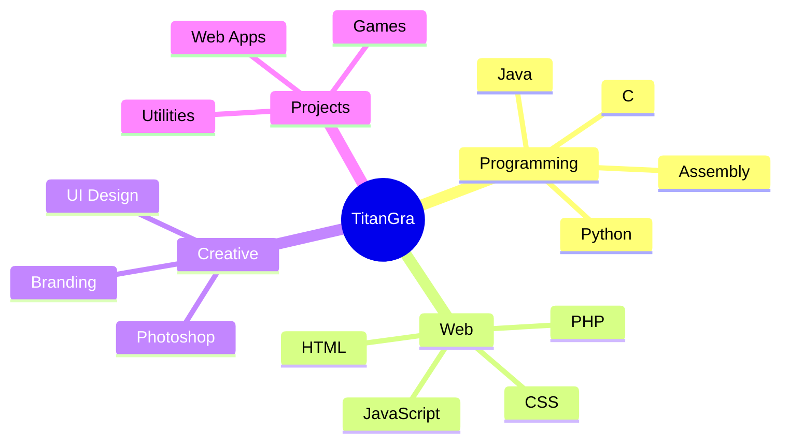

<!--
  TitanGra16 GitHub Profile README
  Created for GitHub profile repository: TitanGra16/TitanGra16
-->

<div align="center">


<br />


<br /><br />

<a href="https://github.com/TitanGra16">
  
</a>
<a href="https://github.com/TitanGra16?tab=followers">
  
</a>
<a href="https://github.com/TitanGra16?tab=repositories">
  
</a>

</div>

---

## 🟣 About me

```txt
Name      : TitanGra
Focus     : Web development, software, tools, creative coding
Mindset   : Learn, build, improve, repeat
Style     : Dark UI, purple neon, clean code, practical apps
```

I'm a developer and creative builder who likes turning ideas into real projects.  
I enjoy working on **web apps**, **utilities**, **games**, **graphics**, and anything that mixes code with design.

---

## ⚡ Tech stack

<div align="center">

### Languages


### Tools & platforms


</div>

---

## 🚀 Featured projects

<table>
  <tr>
    <td width="50%">
      <h3 align="center">🎮 PS3 Home Button Helper</h3>
      <p align="center">
        <a href="https://github.com/TitanGra16/ps3-home-button-helper">
          
        </a>
      </p>
      <p align="center">
        Lightweight PWA to send the PS/Home command to a compatible PS3 from phone, tablet or PC.
      </p>
    </td>
    <td width="50%">
      <h3 align="center">🧪 Simplex Tutor</h3>
      <p align="center">
        <a href="https://github.com/TitanGra16/simplex-tutor">
          
        </a>
      </p>
      <p align="center">
        A project made to learn, test and explain simplex method concepts.
      </p>
    </td>
  </tr>
</table>

---

## 📊 GitHub stats

<div align="center">


<br /><br />


</div>

---

## 🐍 Contribution animation

<div align="center">


</div>

> To enable this animation, add the workflow file shown below in `.github/workflows/snake.yml`.

---

## 🧠 Currently learning

<div align="center">



</div>

---

## 🌌 Motto

<div align="center">


</div>

---

<div align="center">


</div>
